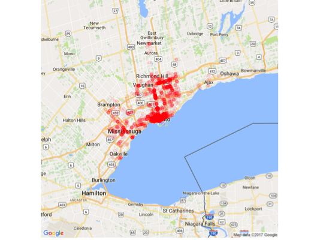
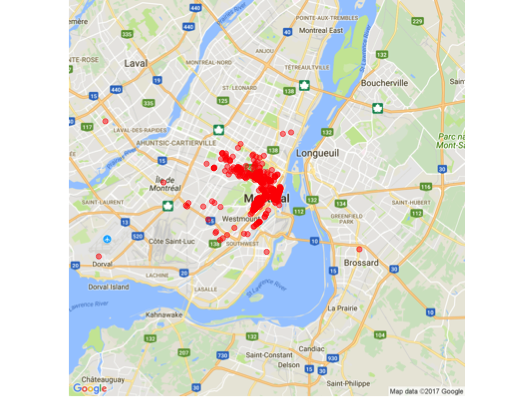

*Predicting restaurant ratings*

## Problem Statement

>You will create a recommendation system for restaurants using regression, matrix factorization, and something else of your choice, and combine them using an ensemble method. At each point you will see if your model’s performance improves. The recommenders will not be particularly good or sophisticated, but you should carry out the entire process and on the way, you’ll learn a lot about the gotchas and subtleties involved.

In particular, we have developed a recommendation system for restaurants in Yelp's academic dataset in Ontario and Quebec, Canada. 

| **Toronto, Ontario**            | **Montreal, Quebec**           |
|---------------------------------|--------------------------------|
|  |  |

*Source: Google Maps and ggmap*
